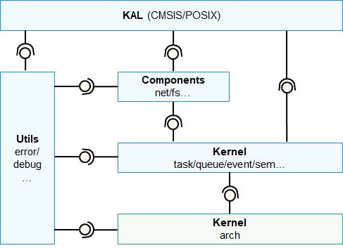

# LiteOS Cortex-M<a name="EN-US_TOPIC_0000001096757661"></a>

-   [Introduction](#section11660541593)
-   [Directory Structure](#section161941989596)
-   [Constraints](#section119744591305)
-   [Usage](#section3732185231214)
-   [Repositories Involved](#section1371113476307)

## Introduction<a name="section11660541593"></a>

The OpenHarmony LiteOS Cortex-M is the kernel designed for the lightweight operating system \(OS\) for the Internet of Things \(IoT\) field. It features small size, low power consumption, and high performance. In addition, it has a simple code structure, including the minimum kernel function set, kernel abstraction layer, optional components, and project directory, and is divided into the hardware-related and hardware-irrelevant layers. The hardware-related layers provide unified hardware abstraction layer \(HAL\) interfaces to improve hardware adaptability. The combination and classification of different compilation toolchains and chip architectures meet the requirements of the Artificial Intelligence of Things \(AIoT\) field for rich hardware and compilation toolchains.  [Figure1](#fig0865152210223)  shows the architecture of the OpenHarmony LiteOS Cortex-M kernel.

**Figure  1**  Architecture of OpenHarmony the LiteOS Cortex-M kernel<a name="fig0865152210223"></a>  


## Directory Structure<a name="section161941989596"></a>

```
/kernel/liteos_m
├── components           # Optional components
│   ├── cppsupport       # C++ support
│   └── cpup             # CPU possession (CPUP)
├── kal                  # Kernel abstraction layer
│   ├── cmsis            # CMSIS-compliant API support
│   └── posix            # POSIX API support
├── kernel               # Minimum function set support
│   ├── arch             # Code of the kernel instruction architecture layer
│   │   ├── arm          # Code of the ARM32 architecture
│   │   └── include      # APIs exposed externally
│   ├── include          # APIs exposed externally
│   └── src              # Source code of the minimum function set of the kernel
├── targets              # Board-level projects
├── utils                # Common code
```

## Constraints<a name="section119744591305"></a>

Programming languages: C and C++

Currently applicable architectures: Cortex-M3, Cortex-M4, Cortex-M7, and RISC-V

## Usage<a name="section3732185231214"></a>

LiteOS Cortex-M provides projects for three chip architectures, which are located in the  **targets**  directory. The methods of compiling and using these projects are as follows:

-   Cortex-M3:

The  **kernel/liteos\_m/targets/cortex-m3\_stm32f103\_simulator\_keil**  directory is the Keil project directory created based on the STM32F103 chip architecture. You can download and install Keil development tools from the Internet. To compile the Cortex-M3 project, go to the  **cortex-m3\_stm32f103\_simulator\_keil/project**  directory and double-click the  **los\_demo.uvproj**  file to open the desired project. After the compilation is successful, burn the file to the corresponding board using JLINK or STM32 ST-LINK Utility.

-   Cortex-M4:

The  **kernel/liteos\_m/targets/cortex-m4\_stm32f429ig\_fire-challenger\_iar**  directory is the IAR project directory created based on the STM32F429IG chip architecture. You can download and install IAR development tools from the Internet. To compile the Cortex-M4 project, go to the  **cortex-m4\_stm32f429ig\_fire-challenger\_iar/project**  directory and double-click the  **los\_demo.eww**  file to open the desired project. After the compilation is successful, burn the file to the corresponding board using JLINK or STM32 ST-LINK Utility.

-   Cortex-M7:

The  **kernel/liteos\_m/targets/cortex-m7\_nucleo\_f767zi\_gcc**  directory is the Makefile project directory created based on the STM32F767ZI chip architecture. The compilation commands are as follows:

```
cd kernel/liteos_m/targets/cortex-m7_nucleo_f767zi_gcc
make clean; make
```

After the compilation is successful, the executable file  **NUCLEO-F767.hex**  is generated in the  **cortex-m7\_nucleo\_f767zi\_gcc/build**  directory. Burn the file to the corresponding board using STM32 ST-LINK Utility.

## Change Log

v1.0.1
1. removed these KAL apis: `KalThreadGetInfo`,`KalDelayUs`,`KalTimerCreate`,`KalTimerStart`,`KalTimerChange`,`KalTimerStop`,`KalTimerDelete`,`KalTimerIsRunning`,`KalTickToMs`,`KalMsToTick`,`KalGetMemInfo`
2. add some POSIX apis

v1.0
1. first release

## Repositories Involved<a name="section1371113476307"></a>

**[kernel\_liteos\_m](https://gitee.com/openharmony/kernel_liteos_m)**

